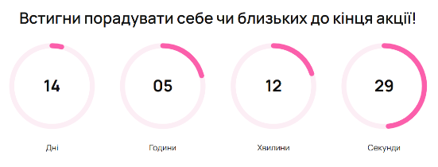

# 🌸 Веборієнтована інформаційна система магазину продажу квітів

Цей проєкт — бакалаврська робота з розробки інформаційної системи для онлайн-магазину продажу квітів на базі WordPress
та WooCommerce.

## 🎯 Мета

Створити зручний, швидкий та сучасний вебсайт для замовлення букетів з кастомізованим функціоналом, орієнтованим на
користувача.

## 🔧 Основні технології

- WordPress 6.7
- WooCommerce
- PHP (кастомні функції)
- HTML/CSS
- JavaScript

## 💡 Реалізовані кастомні функції

- ⏳ **Таймер до кінця акції** – виводиться на сторінці за допомогою шорткоду `[sale_timer]`, працює через JavaScript.
- 💐 **Автоматична знижка при купівлі 3+ букетів** – застосовується автоматично в кошику.

## 🗂️ Структура проєкту

- `flower-custom-functions/` — кастомний плагін з PHP-кодом
- `docs/` — скріншоти реалізації
- `.gitignore` — виключення зайвих файлів
- `LICENSE` — ліцензія на відкритий код (MIT)

## ✅ Якість коду, лінтинг та документування

### 1. Лінтер

У проєкті використовується **PHP_CodeSniffer** із стандартом **WordPress Coding Standards** (WPCS) для перевірки стилю
коду.
Це дозволяє підтримувати код чистим, безпечним та читабельним відповідно до вимог **WordPress**.

Лінтер перевіряє:

* правильні відступи (табуляції)
* коректні коментарі PHPDoc (`@param`, `@return`)
* пробіли, дужки та форматування
* обробку HTML-виводу функціями `esc_html()`, `esc_attr()` тощо

---
📌 **Документування функцій** за стандартом PHPDoc було розпочато в рамках лабораторної роботи №4 при впровадженні
лінтера та
автоматичної перевірки коду.
Зокрема, всі публічні функції плагіна мають опис згідно зі стандартом WPCS і PHPDoc.
---

### 2. Скрипт в Composer

У `composer.json` знаходиться скрипт для запуску лінтера вручну.

Перевірити код можна так:

```bash
composer run check    # перевірка
composer run lint     # перевірка
composer run lint:fix # автовиправлення
```

### 3. Git Hooks

У проєкті налаштовано `pre-commit` хук, який запускає лінтер перед кожним комітом.
Якщо у коді знайдено помилки стилю — коміт буде скасовано.

### 4. Документування коду

Усі публічні функції документуються у форматі `/** ... */` згідно зі стандартом PHPDoc.

Вказуються:

* короткий опис функції
* тип та опис параметрів (`@param`)
* тип повернення (`@return`)

Коментарі також додаються до WordPress-хуків та JavaScript-функцій, що впливають на
бізнес-логіку. Приклад документування функції:

```bash
/**
* Знижка при купівлі 3+ букетів.
*
* @param WC_Cart $cart Кошик покупця.
* @return void
*/
  function custom_bulk_discount( $cart ) { ... }
```

#### Інтеграція генерації документації у процес збірки

Автоматична генерація HTML-документації реалізована через `pre-commit hook`.
При кожному коміті в репозиторій відбувається:

1. Перевірка коду лінтером PHP_CodeSniffer.
2. У разі успішної перевірки автоматично запускається генерація документації через phpDocumentor.
3. Новостворена документація зберігається у директорії `docs/phpdocs/`.
4. Коміт завершується тільки після успішної генерації документації.

Файл `.git/hooks/pre-commit`:

```bash
#!/bin/sh
echo "Running phpcs before commit..."
./vendor/bin/phpcs --standard=WordPress flower-custom-functions/

if [ $? -ne 0 ]; then
  echo "Linter failed. Commit aborted."
  exit 1
fi

echo "Generating documentation..."
php phpdoc.phar -d flower-custom-functions -c phpdoc.xml

echo "Linter passed. Documentation generated. Commit allowed."
```

Згенерована документація доступна у папці: `docs/phpdocs/index.html`. Це дозволяє підтримувати документацію актуальною
без ручного запуску генерації.

### 5. Архітектурні рішення

Проєкт реалізований у вигляді WordPress плагіна з підтримкою кастомного функціоналу для інтернет-магазину квітів.

#### Структура проєкту:

* `flower-custom-functions/` — основний функціонал плагіна (PHP-код)
* `docs/` — статичні ресурси та документація
* `docs/phpdocs/` — автоматично згенерована HTML-документація
* Конфігураційні файли: `.gitignore`, `phpcs.xml`, `phpdoc.xml`, `composer.json`

### 6. Бізнес-логіка

Основні можливості плагіна:

* SVG-таймер акції зворотного відліку
* Надання знижки 10% при купівлі 3+ букетів у кошику WooCommerce
* Реєстрація шорткоду `[sale_timer]` для виведення таймера на сторінку сайту

### 7. Алгоритми

#### Приклад: Алгоритм роботи таймера зворотного відліку

Функція: `custom_sale_countdown_timer( $atts )`

Етапи роботи:

1. Отримання параметра end_date через атрибути шорткоду
2. Формування HTML-розмітки SVG-таймера
3. Обробка логіки оновлення таймера на JavaScript:
    * Обрахунок днів, годин, хвилин, секунд до кінця акції
    * Анімація прогрес-кілець (SVG circle)
4. Виведення таймера на сторінку

### 8. Взаємодія між компонентами

Плагін побудований на основі стандартних механізмів WordPress та WooCommerce,
що забезпечує гнучку взаємодію між його частинами. Кожен компонент виконує
окрему роль, але взаємопов'язаний із рештою — як у частині відображення
(frontend), так і в частині логіки (backend).

| Компонент                               | Призначення                                                | Механізм взаємодії                                                                                                        |
|-----------------------------------------|------------------------------------------------------------|---------------------------------------------------------------------------------------------------------------------------|
| Шорткод `[sale_timer]`                  | Відображення SVG-таймера зворотного відліку до кінця акції | Реєструється через `add_shortcode()`. Викликає функцію `custom_sale_countdown_timer( $atts )`, що генерує HTML/SVG таймер |
| Функція `custom_sale_countdown_timer()` | Генерує таймер із датою завершення акції                   | Працює із переданим атрибутом `end_date`. Виводить розмітку + стилі + JS                                                  |
| JavaScript таймер                       | Відображення відліку часу в режимі реального часу          | Оновлює DOM-елементи SVG через `setInterval`. Відображає дні/години/хвилини/секунди та анімує кола                        |
| Функція `custom_bulk_discount()`        | Додає знижку при купівлі ≥3 букетів                        | Перевіряє кількість товарів у кошику, обчислює знижку 10% від суми, додає її як `fee` у WooCommerce                       |
| Хук `woocommerce_cart_calculate_fees`   | Автоматично викликає функцію `custom_bulk_discount()`      | Працює при кожному оновленні кошика. Забезпечує інтеграцію із логікою WooCommerce                                         |

### 9. Приклади використання функцій

#### Приклад 1. Використання шорткоду для виводу таймера акції

Вставте у контент сторінки WordPress та вкажіть дату завершення акції:

`[sale_timer end_date="2025-12-31 23:59:59"]`

**Очікуваний результат:**

→ Відображається SVG-таймер із зворотним відліком до вказаної дати.

→ Після завершення акції таймер показує повідомлення:
"⏰ Акція завершена!"



#### Приклад 2. Автоматична знижка при купівлі 3+ букетів

Тест-кейс для перевірки:

1. Користувач додає у кошик 3 або більше товарів.
2. Переходить на сторінку оформлення замовлення.
3. Автоматично додається знижка 10% до підсумкової вартості замовлення.

**Очікуваний результат:**

У кошику з'являється напис: `Знижка на обʼємне замовлення`

Сума знижки = 10% від суми товарів.


## 👤 Автор

**Юлія Костенко, Сумський державний університет**  
Бакалаврська робота, 2025

## 📬 Контакти

📧 **Email:** [ulakostenko7@gmail.com](mailto:ulakostenko7@gmail.com)  
💬 **Telegram:** [Написати](https://t.me/ulakostenko)  
💻 **GitHub:** [ulakostenko](https://github.com/ulakostenko)

---

© 2025 Юлія Костенко. Всі права захищені. 